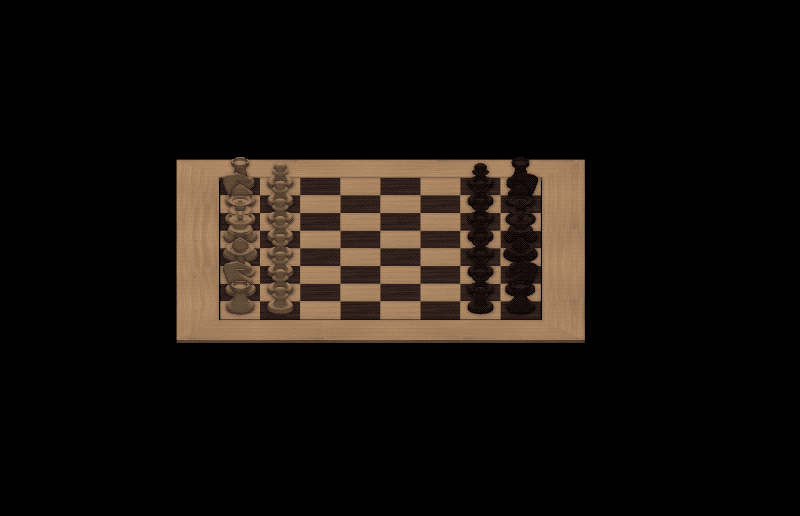
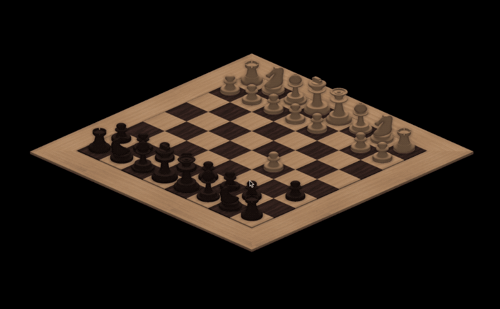
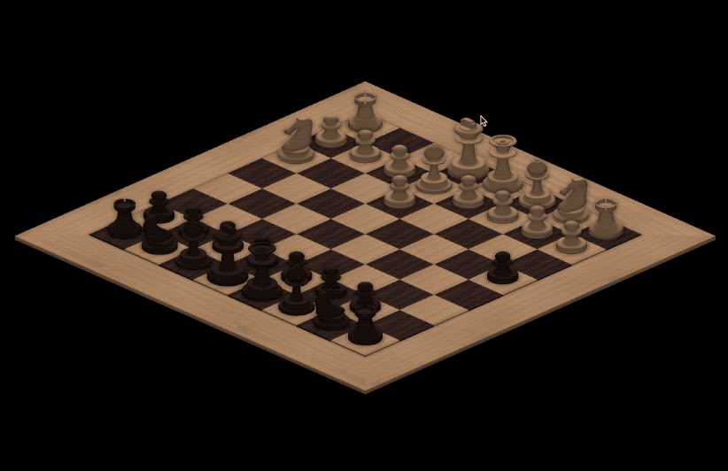
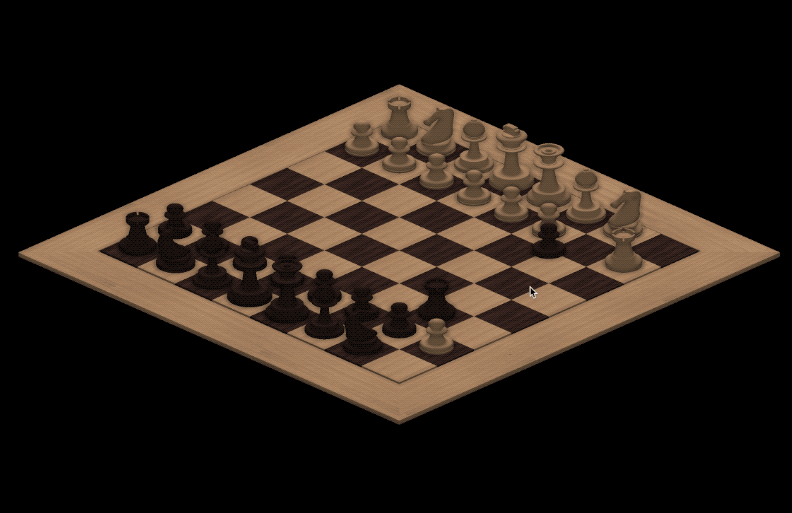

# Chess
A clone of widely-known logic game.
The project showcases features and abilities of a graphics engine that I've developed.
The game is complete in terms of rules implemented
 

    

 
## Application
* Supports having multiple sessions open
* Handles mouse interactions for pieces selection and movement
* Provides control over the camera through keyboard bindings 

# Rules
* Game implements no time limit for move
* Player can change piece he picked for move
* Moves cannot be changed
* Game begins with turn of a person who chose white pieces 

## Controlls
* `a`, `d` - rotate the camera
* `f` - toggle fullscreen
* `cmd` + `n` - new session
* `cmd` + `w` - close session

## Can I try?
No, let me explain...
 
Application is built on top of an engine developed by myself - [P0rc3lain](https://github.com/P0rc3lain/Engine).
Its code is going to be released soon - once I finally decide that fhe form is close to what I expect from it.
Until then only the game and engine's interface (through the project's code) can be examinated

## Gameplay

#### En passant

    

#### Castling

    

#### Pawn promotion

    

#### Multiple sessions

    

## Contributions
I doubt that anyone ever is going to either extend or polish the application.
Nonetheless I invite YOU to give me suggestions of any sort.
I would be more than happy to read them and/(if you'd like to) engage into a discussion 
