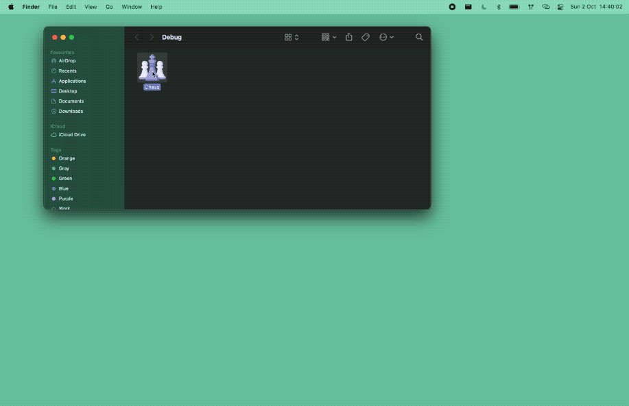

# Chess
The project showcases features and abilities of a graphics engine that I've developed.

## Application
* Supports having multiple sessions open
* Handles mouse interactions for pieces movement
* Provides control over the camera through keyboard bindings 

## Controlls
* `a`, `d` - rotate the camera
* `f` - toggle fullscreen
* `cmd` + `n` - new session
* `cmd` + `w` - close session

## The Engine
[P0rc3lain](https://github.com/P0rc3lain/Engine)

## Gameplay
#### En passant

    

#### Castling

    

#### Pawn promotion

    

#### Multiple sessions

    

## Contributions
I doubt that anyone ever is going to either extend or polish the application.
Nonetheless I count on YOU to give me suggestions of any sort.
I would be more than happy to read them and/(if you'd like to) engage into a discussion 
